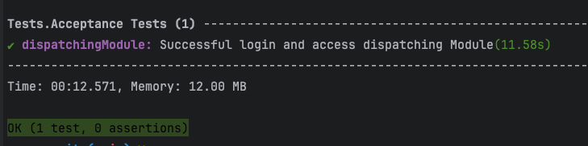

# Project Setup Guide

This document provides a step-by-step guide to setting up your development environment for our PHP project. Please follow the instructions carefully to ensure a smooth setup process.
## Setup Test on Docker
### Build Docker
To start just execute

```bash
make build-image
```

### Execute Test on Docker
Execute:
```bash
make bash
```
In Docker Container run:

```bash
php vendor/bin/codecept run Acceptance
```

## Prerequisites to run Test with Browser

Before you begin, ensure that you have the following installed on your system:

- PHP 8.2
- Composer
- ChromeDriver
### For Mac
#### Installing PHP 8.2

To install PHP 8.2, you can use a package manager such as `apt` on Ubuntu or `brew` on macOS. Here are the steps for each:

```bash 
brew install php@8.2
```

#### Installing Composer

To install Composer, you can use a package manager such as `apt` on Ubuntu or `brew` on macOS. Here are the steps for each:

```bash 
brew install composer
```

#### Installing Chromedriver

To install Chromedriver, you can use a package manager such as `apt` on Ubuntu or `brew` on macOS. Here are the steps for each:
```bash 
brew install --cask chromedriver
```
Remember to allow chromedriver on Mac Settings

------
### For Linux
#### Installing PHP 8.2

To install PHP 8.2, you can use a package manager such as `apt` on Ubuntu or `brew` on macOS. Here are the steps for each:

```bash 

```

#### Installing Composer

To install Composer, you can use a package manager such as `apt` on Ubuntu or `brew` on macOS. Here are the steps for each:

```bash 

```

#### Installing Chromedriver

To install Chromedriver, you can use a package manager such as `apt` on Ubuntu or `brew` on macOS. Here are the steps for each:
```bash 

```

------


## Execute Test
### First Step
Ensure that your localhost is already running. Check http://localhost:8080.

### Second Step
Open a new Terminal window or tab and execute the following command:
```bash
chromedriver --port=4444 --url-base=wd/hub
```

### Third Step
Open a new Terminal window or tab and execute the following command:
```bash
php vendor/bin/codecept run Acceptance
```

If everything is set up correctly, you will see a Chrome window, and in the console window, you should see this message:


